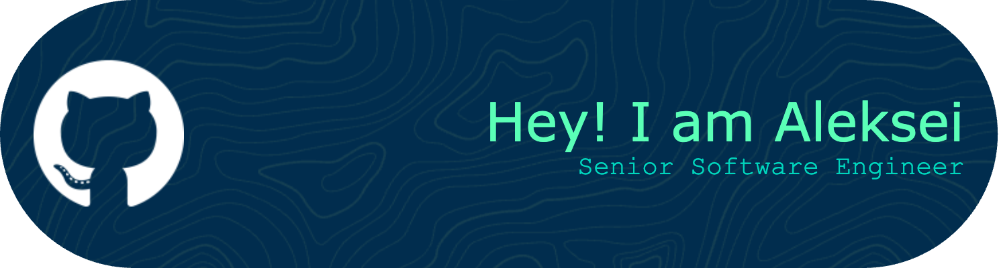

<!--
**AlekseiZhynguel/AlekseiZhynguel** is a ✨ _special_ ✨ repository because its `README.md` (this file) appears on your GitHub profile.

Here are some ideas to get you started:

- 🔭 I’m currently working on ...
- 🌱 I’m currently learning ...
- 👯 I’m looking to collaborate on ...
- 🤔 I’m looking for help with ...
- 💬 Ask me about ...
- 📫 How to reach me: ...
- 😄 Pronouns: ...
- ⚡ Fun fact: ...
-->

---

### 📚 Bio:

I have worked on banking and digital payment projects, where I led the development of microservices and the migration to more scalable and efficient architectures. My focus is on code quality, implementing best programming practices, and continuous improvement of the development process. I have skills in automated testing, continuous integration and deployment, as well as using tools like Docker, Kubernetes, Git, and Azure DevOps to manage the software lifecycle. Passionate about technology, I am committed to contributing to challenging projects and continuously enhancing my skills within an agile and collaborative environment.

---

### :technologist: About Me :
- 🔭 I'm currently working on a personal project, aiming for educational purposes, developing a bank application that utilizes event-driven architecture. My goal is to integrate smart contracts and cryptocurrencies into this endeavor.
- 🌱 I’m currently learning Golang and Solidity.
- 🤔 Interests: DDD, good practices, system design, agile methodologies, leadership and management.

---

### :hammer_and_wrench: Languages and Tools :

  &nbsp;
  &nbsp;
  &nbsp;
  &nbsp;
  &nbsp;
  &nbsp;
  &nbsp;
  &nbsp;
  &nbsp;
  &nbsp;
  &nbsp;
  &nbsp;
  

